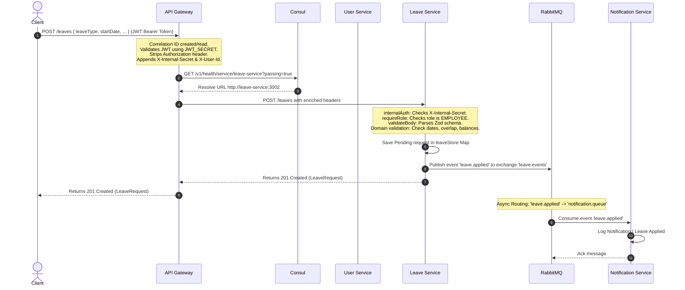
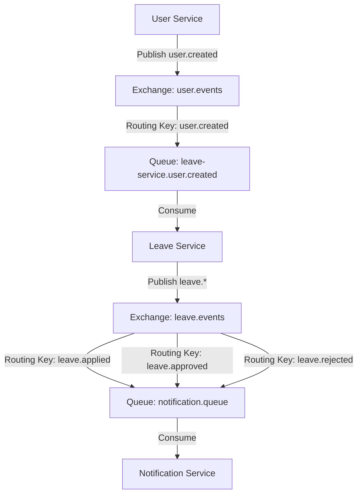

# Leave Management System — Overall Overview of System Flow

This document serves as a persistent, high-fidelity internal representation and mental model of the Leave Management System repository. It details the repository structure, architecture, runtime execution flows, layers, coding patterns and integration points

---

## 1. Repository Discovery & Monorepo Map

### Workspace Structure
The project is set up as a monorepo using **NPM Workspaces**, which are defined in the root [package.json:
* `packages/*` contains shared libraries/packages.
* `services/*` contains deployable microservices.

### Build System & Package Manager
* **Package Manager**: NPM (v10+ workspaces support).
* **Compiler**: TypeScript (v6+), compiling code to CommonJS/ES2020 target using Node.js 20.
* **Build Outputs**: Built incrementally into a `dist` folder inside each package/service directory.

### TypeScript Configuration Hierarchy
1. [tsconfig.base.json] (Root): Holds global compilation flags (strict mode, target `ES2020`, module resolution, esModuleInterop, declaration generation).
2. [packages/shared/tsconfig.json]: Extends base configs and compiles code inside `src/` to `dist/` with composite mode enabled.
3. **Service tsconfigs** (e.g., `services/api-gateway/tsconfig.json`): Extend base configurations, reference the composite shared package project (`"references": [{ "path": "../../packages/shared" }]`), and path map imports:
   ```json
   "paths": {
     "@leave-mgmt/shared": ["../../packages/shared/src"]
   }
   ```

### Docker & Infrastructure Setup
* **Containerization**: Each microservice uses a multi-stage `Dockerfile` (`builder` stage building with TS, `production` stage using minimal dependencies under a non-root `appuser`).
* **Service Orchestration**: Managed via [docker-compose.yml](file:///c:/Users/aksha/NAGP-Microservices/leave-management-system/docker-compose.yml), running services on a bridge network `leave-net`.
* **Platform Services**:
  * **Consul**: Service Registry (`port 8500`).
  * **RabbitMQ**: AMQP Broker (`port 5672`, UI on `15672`).
  * **Jaeger**: Distributed Tracing UI (`port 16686`, OTLP over HTTP `port 4318`).

### Repository Map

| Service Name | Port | Entry Point | Purpose | Key Dependencies | Communication Patterns |
| :--- | :---: | :--- | :--- | :--- | :--- |
| **api-gateway** | `3000` | `src/index.ts` | External gateway, JWT authentication, request routing, Consul resolution, circuit breaking | `opossum`, `axios`, `jsonwebtoken`, `pino` | **Incoming**: Sync HTTP REST<br>**Outgoing**: Sync HTTP REST (downstream services) |
| **user-service** | `3001` | `src/index.ts` | User identity management, login API, JWT signing, user creation events | `bcryptjs`, `jsonwebtoken`, `amqp-connection-manager` | **Incoming**: Sync HTTP REST (from Gateway)<br>**Outgoing**: Async AMQP (publishes `user.created`) |
| **leave-service** | `3002` | `src/index.ts` | Leave requests, balances management, approval workflow, balance deduction | `amqp-connection-manager`, `zod` | **Incoming**: Sync HTTP REST, Async AMQP (consumes `user.created`) <br>**Outgoing**: Async AMQP (publishes leave workflow events) |
| **notification-service** | `3003` | `src/index.ts` | Asynchronous consumer logging leave activities | `amqp-connection-manager` | **Incoming**: Async AMQP (consumes leave events)<br>**Outgoing**: Structured console logs |
| **shared (package)** | N/A | `src/index.ts` | Common types, domain models, shared errors, status constants | None | Used internally via TypeScript imports |

---

## 2. Architecture Analysis

The Leave Management System utilizes a microservices architecture relying on dynamic service discovery, distributed tracing, and event-driven choreography.

```text
                         [ Client / Postman ]
                                  |
                                  | REST HTTP (port 3000)
                                  v
+-------------------------------------------------------------------------+
|                              API Gateway                                |
|  - JWT validation                                                       |
|  - Request Enrichment & Header Stripping (adds X-User-Id, etc.)         |
|  - Circuit Breakers (Opossum)                                           |
|  - Service Discovery resolution (via Consul)                            |
+-------------------------------------------------------------------------+
       |                                           |
       | REST HTTP                                 | REST HTTP
       | (port 3001)                               | (port 3002)
       v                                           v
+-----------------------------+             +-----------------------------+
|        User Service         |             |        Leave Service        |
|  - Auth/Login (JWT signing) |             |  - Leave Requests Management|
|  - User CRUD / Map storage  |             |  - Leave Balance management |
|  - Internal Auth Validation |             |  - Internal Auth Validation |
+-----------------------------+             +-----------------------------+
       |                                           |              ^
       | user.created                              | leave events | user.created
       | (Topic Exchange)                          | (applied,    | (Init
       v                                           v approved,    | balances)
+-------------------------------------------------------------+   |
|                          RabbitMQ                           |---|
|  - Exchange: user.events  -> Queue: leave-service.user.created   |
|  - Exchange: leave.events -> Queue: notification.queue      |
+-------------------------------------------------------------+
                               |
                               | (applied, approved, rejected)
                               v
                +-----------------------------+
                |    Notification Service     |
                |  - Logs notifications       |
                |  - Health check only        |
                +-----------------------------+
```

### Communication Types
* **Synchronous Communication**: HTTP/REST is used for user queries and write operations. The client calls the Gateway, and the Gateway proxies it downstream via HTTP.
* **Asynchronous Communication**: Message broker (RabbitMQ) decouples secondary actions (like initializing new employee balances or executing notifications).
* **Service Discovery**: API Gateway resolves service hosts via Consul's HTTP API: `${consulUrl}/v1/health/service/${serviceName}?passing=true`. If lookup fails, it defaults to a local fallback mapping.
* **OpenTelemetry/Observability**: Every service imports a tracing file before execution. OpenTelemetry instrumentations auto-wrap HTTP libraries, Express, and AMQP. Trace graphs are exported to Jaeger via OTLP (`/v1/traces`).

### Authentication & Authorization Flow
1. **Credentials verification**: The client calls `POST /auth/login` to obtain a JWT.
2. **Gateway validation**: For non-public paths, the Gateway's `auth` middleware intercepts the incoming `Bearer <token>` header, decodes it using `JWT_SECRET`, and deletes the original `Authorization` header.
3. **Gateway enrichment**: The Gateway appends standard HTTP headers before routing downstream:
   * `X-User-Id`: The authenticated user's unique ID.
   * `X-User-Role`: The authenticated user's role (`EMPLOYEE` or `MANAGER`).
   * `X-Internal-Secret`: A pre-shared key validating the request originated from the Gateway.
   * `X-Correlation-Id`: A tracing ID carried through the request chain.
4. **Downstream verification**: Services invoke `internalAuth` middleware. It checks `X-Internal-Secret` matching the local config, extracts the user details, and places them into `req.user`.
5. **Route-level authorization**: Services call `requireRole('ROLE')` to enforce domain access rules.

---

## 3. Runtime Flow Analysis

### Service Startup Flow
On startup, each microservice executes the following steps in sequence:
1. **Observability Initialization**: Invokes `initTracing(serviceName)` from `lib/tracing.ts` to register SDK auto-instrumentations *before* importing any web frameworks or drivers.
2. **Server Instance Setup**: Instantiates `express()`, binds global middlewares (JSON parsing, custom correlationId, error handlers).
3. **Local Store Seeding**:
   * `user-service` seeds default accounts (`alice@company.com`, `bob@company.com`, `charlie@company.com`) with hashed passwords.
   * `leave-service` seeds default leave allocations for `emp-001` and `emp-002` in memory.
4. **Route Registration**: Registers API paths and error handler interceptors.
5. **Asynchronous Handshakes**:
   * Invokes `connect()` to establish connection handlers with RabbitMQ.
   * Invokes `startConsumer()` to assert AMQP exchanges, queues, bindings, and start subscribing to events.
6. **Server Startup**: Calls `app.listen(PORT)` to bind TCP port.
7. **Service Discovery Registry**: Upon successful port binding, the service calls `registerService()` to register its check route (`/health`) with Consul.
8. **Graceful Shutdown**: Attaches `process.on('SIGTERM')` to deregister from Consul first before exiting.

---

### Request Processing Lifecycle (Apply Leave Example)



---

## 4. Folder & Layer Analysis

The codebase enforces strict layering rules to maintain clear boundaries. The dependency direction is uni-directional: **Routes -> Controllers -> Services -> Repositories -> In-memory Maps**.

### Core Layer Responsibilities
* **Routes**: Maps URI pathways to controllers. Restricts access by attaching authorization/validation middlewares.
* **Controllers**: Gateway to the service. Extracts inputs (parameters, headers, body), forwards execution to the domain service, and formats HTTP responses. Never accesses database stores.
* **Services**: Encapsulates core business rules (e.g., date logic, balance verification, role rules). Triggers AMQP publications.
* **Repositories**: Abstracted layer interacting directly with the in-memory `Map` database. Exposes CRUD APIs.
* **Events/Consumers**: Configures RabbitMQ topology (exchanges, queues, routing keys) and implements listener callbacks.
* **Validators**: Declares input payload constraints using Zod validation.

---

## 5. Coding Patterns & Conventions

* **Error Handling Strategy**: Global standard error payload shape across all microservices:
  ```json
  {
    "error": "Short message detailing error",
    "details": {},
    "correlationId": "uuid"
  }
  ```
  Throwing errors is managed by the custom `AppError` class from `@leave-mgmt/shared`. Express middleware catches these errors, logs them using Pino, and formats the output.
* **Input Validation**: Executed strictly before controller execution via Zod schemas inside `validateBody` and `validateQuery` middleware. Returns 400 Bad Request if validation fails.
* **Data Storage**: Repositories declare a private in-memory `Map<string, T>`. Data changes are synchronous to prevent state inconsistencies on single-threaded event loops (e.g., `deductBalance`).
* **Logging**: Structured JSON logging using Pino. It formats runtime metrics, correlation IDs, and application warning levels.

---

## 6. Integration Points

### RabbitMQ Topology & Event Mapping



### Consul & Registry Configuration
* **Registration**: Services invoke `consul.agent.service.register` during startup, supplying service IDs, ports, and Docker-aware health check URLs.
* **Deregistration**: Hooked into `SIGTERM` handlers to remove instances during updates.

---


